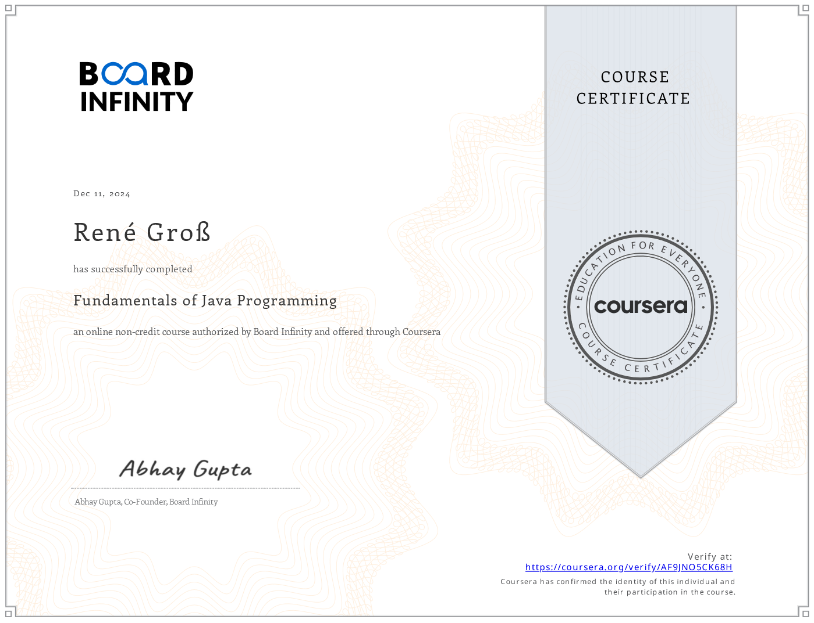

# Java FullStack Developer Specialization

Develop Dynamic Web Applications with Java. Master Java programming, Angular for responsive front-end web development, and Spring and Spring Boot for robust back-end systems, culminating in a comprehensive skillset to build, integrate, and deploy cloud-ready web applications.

- Duration: 3 months at 5 hours a week
- [Final Project](https://github.com/renegrossGit/SimpleSpringBootHackathron.git)

## Fundamentals of Java Programming
- Board Infinity
- Taught by: Board Infinity
- Completed by: René Groß by December 11, 2024

## Data Structures & Backend with Java
- Board Infinity
- Taught by: Board Infinity
- Completed by: René Groß by December 20, 2024

## Frontend for Java Full Stack Development
- Board Infinity
- Taught by: Board Infinity
- Completed by: René Groß by January 10, 2025

[View PDF](img/DataStructures&BackendWithJava.pdf)

[View PDF](img/DataStructures&BackendWithJava.pdf)

[View PDF](img/FundamentalsOfJavaProgramming.pdf)
